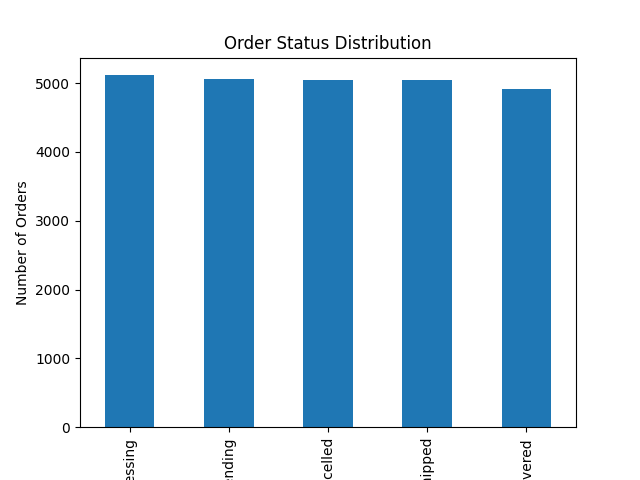
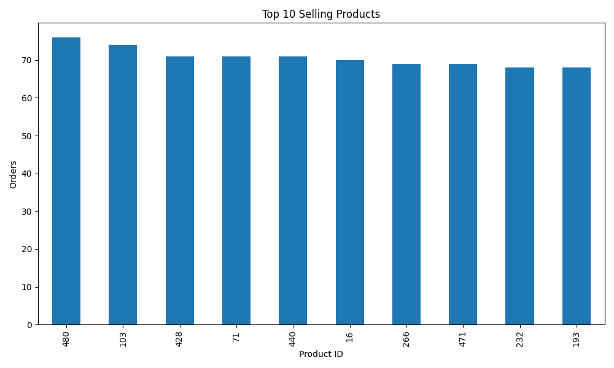
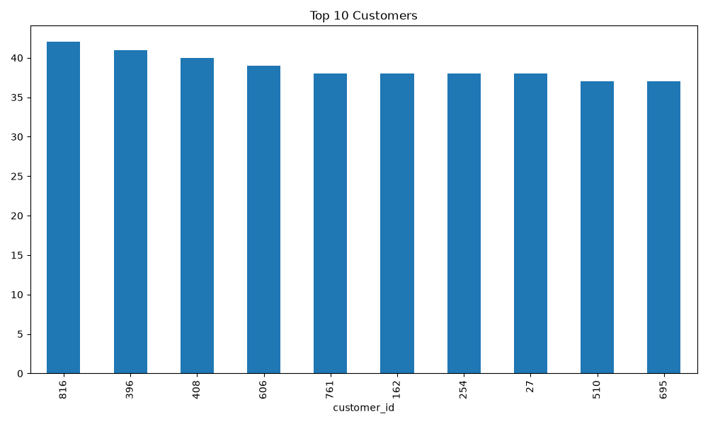
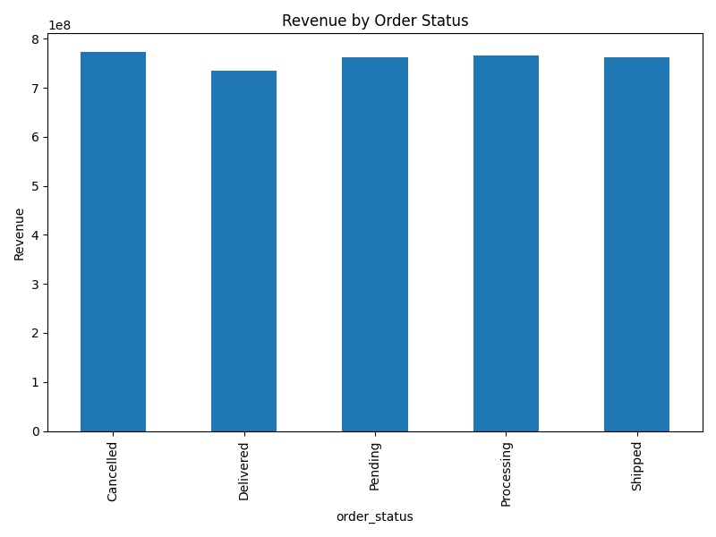
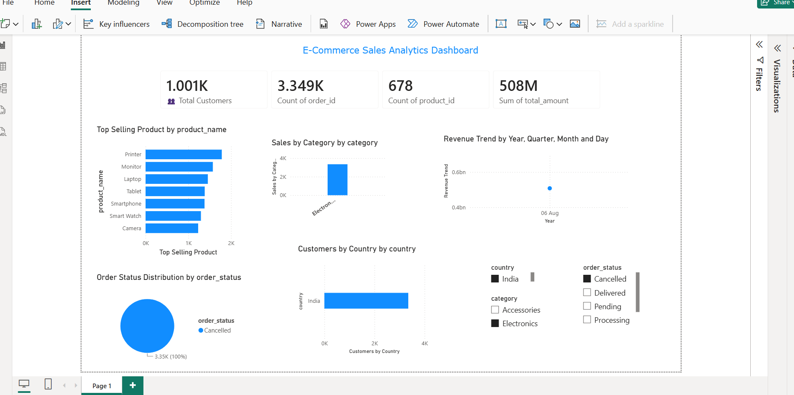

# 🛒 E-Commerce Sales Analytics Dashboard


---

## 📌 Project Overview

**E-Commerce Sales Analytics Dashboard** is a complete end-to-end **Cloud Data Engineering** project that simulates a real-world e-commerce data pipeline.

The project covers every stage of a modern data pipeline:

- Synthetic data generation using **Python + Faker**
- Cloud-hosted storage using **Neon PostgreSQL**
- Data validation and quality checks
- SQL-based business analytics
- Automated CSV export using **Pandas**
- Data visualizations using **Matplotlib**
- Interactive BI dashboard using **Microsoft Power BI**

> 📊 **Live KPIs:** 1,001 Customers | 3,349 Orders | 678 Products | ₹508M Revenue

---

## 🎯 Project Objectives

- Simulate a real-world e-commerce data pipeline from scratch
- Generate large-scale synthetic datasets using Faker
- Store and manage data in a cloud PostgreSQL database
- Perform SQL-based business analytics (revenue, top products, order trends)
- Export processed data to CSV for downstream consumption
- Build Python visualizations for data storytelling
- Create an interactive Power BI dashboard with KPIs, filters, and charts

---

## ✨ Features

| Feature | Description |
|---|---|
| 🏭 Fake Data Generation | 1,000+ customers, 500+ products, 20,000+ orders |
| ☁️ Cloud Database | Neon PostgreSQL — serverless, cloud-hosted |
| 🔍 Data Validation | Null checks, duplicate checks, referential integrity |
| 📤 CSV Export | Automated export of all 3 tables to `exports/` |
| 📊 SQL Analytics | 10+ business queries — revenue, top products, order status |
| 📈 Python Charts | 6 Matplotlib charts — bar, pie, line |
| 📱 Power BI Dashboard | KPI cards, slicers, trend charts, category filters |

---

## 🏗️ Project Architecture

```
┌─────────────────────────────────────────────────────────────────┐
│                    DATA PIPELINE ARCHITECTURE                   │
├─────────────────────────────────────────────────────────────────┤
│                                                                 │
│  ┌──────────────┐    ┌─────────────────┐    ┌───────────────┐  │
│  │ Faker Library│───▶│ Neon PostgreSQL  │───▶│ SQL Analytics │  │
│  │ (Data Gen)   │    │ (Cloud Database) │    │ (10+ Queries) │  │
│  └──────────────┘    └─────────────────┘    └───────┬───────┘  │
│                                                      │          │
│                      ┌───────────────────────────────┘          │
│                      ▼                                          │
│  ┌──────────────┐    ┌─────────────────┐    ┌───────────────┐  │
│  │  CSV Export  │───▶│ Python Charts   │───▶│  Power BI     │  │
│  │  (Pandas)    │    │ (Matplotlib)    │    │  Dashboard    │  │
│  └──────────────┘    └─────────────────┘    └───────────────┘  │
│                                                                 │
└─────────────────────────────────────────────────────────────────┘
```

---

## 🔄 Workflow Diagram

```
Step 1: Generate Data
  └── Faker → customers, products, orders

Step 2: Store in Database
  └── psycopg2 → Neon PostgreSQL (cloud)

Step 3: Validate Data
  └── NULL checks, duplicate checks, row counts

Step 4: SQL Analytics
  └── 10+ queries → revenue, top products, order status

Step 5: Export to CSV
  └── Pandas → exports/customers.csv, products.csv, orders.csv

Step 6: Python Visualizations
  └── Matplotlib → 6 charts saved as PNG

Step 7: Power BI Dashboard
  └── CSV import → KPIs, charts, slicers
```

---

## 📁 Folder Structure

```
Cloud-Data-Engineering/
│
├── analytics/
│   ├── analytics_results.md     ← SQL query results
│   ├── run_analytics.py         ← Programmatic SQL runner
│   └── sql_queries.sql          ← All 10+ analytics queries
│
├── dashboard/
│   └── dashboard.png            ← Power BI dashboard screenshot
│
├── database/
│   ├── __init__.py
│   ├── db_connection.py         ← Neon PostgreSQL connection
│   ├── export_csv.py            ← Export tables to CSV
│   ├── generate_fake_data.py    ← Generate customers & products
│   ├── generate_orders.py       ← Generate orders
│   └── insert_data.py           ← Insert functions
│
├── exports/                     ← Auto-generated CSVs (git-ignored)
│   ├── customers.csv
│   ├── orders.csv
│   └── products.csv
│
├── reports/
│   └── data_validation.md       ← Data quality report
│
├── screenshots/                 ← Project screenshots for README
│
├── visualization/
│   ├── charts.py                ← Order status pie chart
│   ├── customer_country_chart.py
│   ├── revenue_status_chart.py
│   ├── sales_summary_chart.py
│   ├── top_customers_chart.py
│   └── top_products_chart.py
│
├── .env.example                 ← Credential template (safe to commit)
├── .gitignore
├── DEPLOYMENT.md                ← GitHub & cloud deployment guide
├── main.py                      ← ETL pipeline entry point
├── requirements.txt
└── README.md
```

---

## 🛠️ Technologies Used

| Layer | Technology | Purpose |
|---|---|---|
| Language | Python 3.10+ | Core programming |
| Database | Neon PostgreSQL | Cloud data storage |
| DB Driver | psycopg2 | PostgreSQL connection |
| Data Generation | Faker | Synthetic data |
| Data Processing | Pandas | CSV export & manipulation |
| Visualization | Matplotlib | Python charts |
| BI Dashboard | Microsoft Power BI | Interactive dashboard |
| Environment | python-dotenv | Credential management |
| Version Control | Git & GitHub | Source control |

---

## ⚙️ Installation

### Prerequisites

- Python 3.10+
- Git
- Microsoft Power BI Desktop (for dashboard)
- A [Neon PostgreSQL](https://neon.tech) account (free tier works)

### Setup

```bash
# 1. Clone the repository
git clone https://github.com/<your-username>/Cloud-Data-Engineering.git
cd Cloud-Data-Engineering

# 2. Create and activate virtual environment
python -m venv venv
venv\Scripts\activate          # Windows
# source venv/bin/activate     # macOS/Linux

# 3. Install dependencies
pip install -r requirements.txt

# 4. Configure environment variables
copy .env.example .env
# Open .env and fill in your Neon PostgreSQL credentials
```

---

## 📦 Requirements

```
faker==24.0.0
psycopg2-binary==2.9.9
python-dotenv==1.0.1
pandas==2.2.1
matplotlib==3.8.3
sqlalchemy==2.0.28
```

Install all with:
```bash
pip install -r requirements.txt
```

---

## 🚀 How to Run the Project

```bash
# Run the full ETL pipeline (recommended)
python main.py

# Run SQL analytics only
python analytics/run_analytics.py

# Export CSVs only
python database/export_csv.py

# Generate individual charts
python visualization/charts.py
python visualization/top_products_chart.py
python visualization/top_customers_chart.py
python visualization/revenue_status_chart.py
python visualization/customer_country_chart.py
python visualization/sales_summary_chart.py
```

---

## 🗄️ Database Description

The project uses **Neon PostgreSQL** — a serverless, cloud-hosted PostgreSQL platform.

### Tables

| Table | Rows | Description |
|---|---|---|
| customers | 1,001 | Customer profiles with name, email, city, country |
| products | 678 | Product catalog with name, category, brand, price |
| orders | 3,349 | Order transactions linking customers and products |

### Schema

**customers**
```sql
CREATE TABLE customers (
    customer_id  SERIAL PRIMARY KEY,
    first_name   VARCHAR(50),
    last_name    VARCHAR(50),
    email        VARCHAR(100) UNIQUE,
    phone        VARCHAR(20),
    city         VARCHAR(50),
    country      VARCHAR(50)
);
```

**products**
```sql
CREATE TABLE products (
    product_id   SERIAL PRIMARY KEY,
    product_name VARCHAR(100),
    category     VARCHAR(50),
    brand        VARCHAR(50),
    price        NUMERIC(10,2),
    stock        INTEGER
);
```

**orders**
```sql
CREATE TABLE orders (
    order_id      SERIAL PRIMARY KEY,
    customer_id   INTEGER REFERENCES customers(customer_id),
    product_id    INTEGER REFERENCES products(product_id),
    quantity      INTEGER,
    total_amount  NUMERIC(12,2),
    order_status  VARCHAR(20),
    order_date    TIMESTAMP DEFAULT NOW()
);
```

---

## 📊 SQL Analytics

10+ business queries are executed against the database:

| Query | Result |
|---|---|
| Total Customers | 1,001 |
| Total Products | 678 |
| Total Orders | 3,349 |
| Total Revenue | ₹508M |
| Average Order Value | ₹4,945.23 |
| Highest Order | ₹98,500 |
| Lowest Order | ₹500 |
| Top 10 Customers | By order count |
| Top 10 Products | By sales volume |
| Order Status Distribution | Pending / Processing / Delivered / Cancelled |

Run all queries:
```bash
python analytics/run_analytics.py
```

---

## ✅ Data Validation

All three tables pass the following quality checks:

| Check | customers | products | orders |
|---|---|---|---|
| Null Values | ✅ None | ✅ None | ✅ None |
| Duplicate Records | ✅ None | ✅ None | ✅ None |
| Referential Integrity | — | — | ✅ Verified |
| Row Count | 1,001 | 678 | 3,349 |

See full report: [`reports/data_validation.md`](reports/data_validation.md)

---

## 📤 CSV Export

All three tables are exported to the `exports/` folder using Pandas:

```python
df = pd.read_sql("SELECT * FROM customers;", conn)
df.to_csv("exports/customers.csv", index=False)
```

| File | Rows | Size |
|---|---|---|
| customers.csv | 1,001 | ~80 KB |
| products.csv | 678 | ~45 KB |
| orders.csv | 3,349 | ~200 KB |

---

## 📈 Python Visualizations

Six charts are generated using Matplotlib:

| Chart | File | Type |
|---|---|---|
| Order Status Distribution | `charts.py` | Pie Chart |
| Top Selling Products | `top_products_chart.py` | Bar Chart |
| Top Customers | `top_customers_chart.py` | Bar Chart |
| Revenue by Status | `revenue_status_chart.py` | Bar Chart |
| Customers by Country | `customer_country_chart.py` | Bar Chart |
| Sales Summary | `sales_summary_chart.py` | Line/Bar Chart |

### Chart Previews

<!-- Add Python chart screenshots below -->
| Order Status | Top Products |
|---|---|
|  |  |

| Top Customers | Revenue by Status |
|---|---|
|  |  |

---

## 📱 Power BI Dashboard

The Power BI dashboard is built on top of the exported CSV files and provides interactive business intelligence.

### Dashboard Screenshot



---

## 📊 Dashboard Features

### KPI Cards

| KPI | Value |
|---|---|
| 👥 Total Customers | 1,001 |
| 🛒 Total Orders | 3,349 |
| 📦 Total Products | 678 |
| 💰 Total Revenue | ₹508M |

### Charts

| Visual | Type | Insight |
|---|---|---|
| Top Selling Products | Horizontal Bar | Printer leads with ~1,900 sales |
| Sales by Category | Bar Chart | Electronics dominates |
| Revenue Trend | Line Chart | Revenue over time by year/quarter |
| Order Status Distribution | Pie Chart | Status breakdown |
| Customers by Country | Bar Chart | India is the top market |

### Slicers (Filters)

- Country
- Product Category
- Order Status

---

## 🔮 Future Enhancements

- [ ] Migrate to AWS RDS or Azure PostgreSQL
- [ ] Add Apache Airflow for pipeline orchestration
- [ ] Implement dbt for data transformation layer
- [ ] Add real-time streaming with Apache Kafka
- [ ] Deploy REST API with FastAPI to serve analytics
- [ ] Add CI/CD pipeline with GitHub Actions
- [ ] Containerize with Docker
- [ ] Add unit tests with pytest

---

## 🏁 Conclusion

This project demonstrates a complete, production-style data engineering pipeline — from raw data generation to interactive business intelligence. It covers all key skills required for a Data Engineer role: database design, SQL analytics, Python scripting, data processing, and BI dashboarding.

---

## 👤 Author

**Goran**

[](https://linkedin.com/in/<your-linkedin>)
[](https://github.com/<your-username>)

- 📧 Email: `<your-email>`
- 💼 LinkedIn: `<your-linkedin>`
- 🐙 GitHub: `<your-github>`

---

## 📄 License

This project is licensed under the [MIT License](LICENSE).

---

## ⭐ Support

If you found this project helpful, please give it a ⭐ on GitHub — it helps others discover it!
